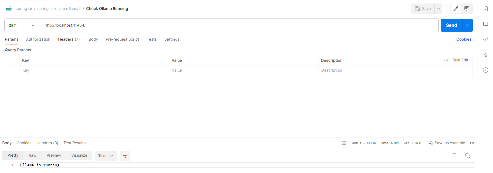

# Spring-AI-Ollama-llama2

## Ollama

Get up and running with large language models locally.

## Docker

[Ollama Docker image](https://hub.docker.com/r/ollama/ollama)


## Quickstart

To run and chat with [Llama 2](https://ollama.com/library/llama2):

Going with 7B parameters.

```
ollama run llama2:7b
```

## Model library

Ollama supports a list of models available on [ollama.com/library](https://ollama.com/library)

Here are some example models that can be downloaded:

| Model              | Parameters | Size  |  Download                       |
| ------------------ | ---------- | ----- | ------------------------------	|
| Llama 3            | 8B         | 4.7GB | `ollama run llama3`       	|
| Llama 3            | 70B        | 40GB  | `ollama run llama3:70b`  	|
| Phi-3              | 3,8B       | 2.3GB | `ollama run phi3`          	|
| Llama 2            | 7B         | 3.8GB | `ollama run llama2:7b`  	|


## Memory requirements
- 7b models generally require at least 8GB of RAM
- 13b models generally require at least 16GB of RAM
- 70b models generally require at least 64GB of RAM


## REST API

Ollama has a REST API for running and managing models.

### Generate a response

```
curl http://localhost:11434/api/generate -d '{
  "model": "llama2:7b",
  "prompt":"Tell me something about llama2"
}'
```

### Chat with a model

```
curl http://localhost:11434/api/chat -d '{
  "model": "llama2:7b",
  "messages": [
    { "role": "user", "content": "Tell me something about llama2" }
  ]
}'
```


### WebUI

WebUI for LLMs (Formerly Ollama WebUI)

- [Open WebUI](https://github.com/open-webui/open-webui)


### Llama2 Model


### Llama2 using Ollama


### Ollama Running




### Generate a response


### Chat with a model


